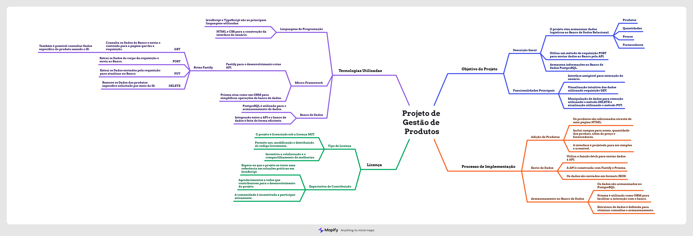

# Projeto de Gerenciador de Estoque em TypeScript
 O projeto destina-se a armazenar dados logístico de produtos, quantidades, preço, fornecedor no Banco de Dados a partir de um método de requisição *POST* a API que extrai os dados da requisição e armazena no **Postgres** usando o micro-framework **Prisma**. Também, uma visualição intuitiva dos dados usando o método de requisição *GET*. Além de manipulação intuitiva para remoção e atualização desses dados.

> [!NOTE]
>
> Este projeto foi desenvolvido com foco prático com objetivo de proporcionar uma experiência em programação TypeScript e JavaScript, direcionada a gestão de estoque de produtos. Recomenda-se utilizá-lo como base para aprender e experimentar, mas não necessariamente como uma solução de estoque completa para ambientes de produção.

## Processo
1. Adição de produtos ao estoque com respectivos nomes, quantidades, preço e fornecedores na página HTML.
2. Extração dos dados inseridos nos inputs da página HTML
3. Envio desses dados pela requisição ```fetch``` para API de Banco de Dados do **Postgres**.
2. Armazenagem dos dados no Banco por meio do **Prisma ORM**.
3. Consulta dos dados armazenados dentro do Banco do **Postgres** com o comando: `await prisma.products.findMany();`
4. Visualização intuitiva do estoque atualizado.
   


## Tecnologias Utilizadas
* JavaScript
* TypeScript
* HTML
* CSS
* Fastify
* Prisma

## Contribuição
 Contribuições são bem-vindas! Sinta-se à vontade para melhorar a estrutura, adicionar funcionalidade ou corrigir qualquer problema identificado.

### Diretrizes de Contribuição
- Mantenha o código limpo, seguindo as melhores práticas de JavaScript, Express, ORM ou Banco de Dados.
- Adicione comentátios explicativos após fazer alguma mundança no código para facilitar a compreensão.
- Seja cordial e construtivo nas discussões Pull Requests.

### Licença
 Este projeto é licenciado sob a [licença MIT](LICENSE), o que significa que você é livre para usar, modificar e distribuir este código.
 Esperamos contar com sua contribuição para tomar o Projeto JavaScript uma referência de solução práticas em JavaScript. Obrigado por fazer parte desta comunidade!

 ## Proprietário do Projeto
 @Gustx21
